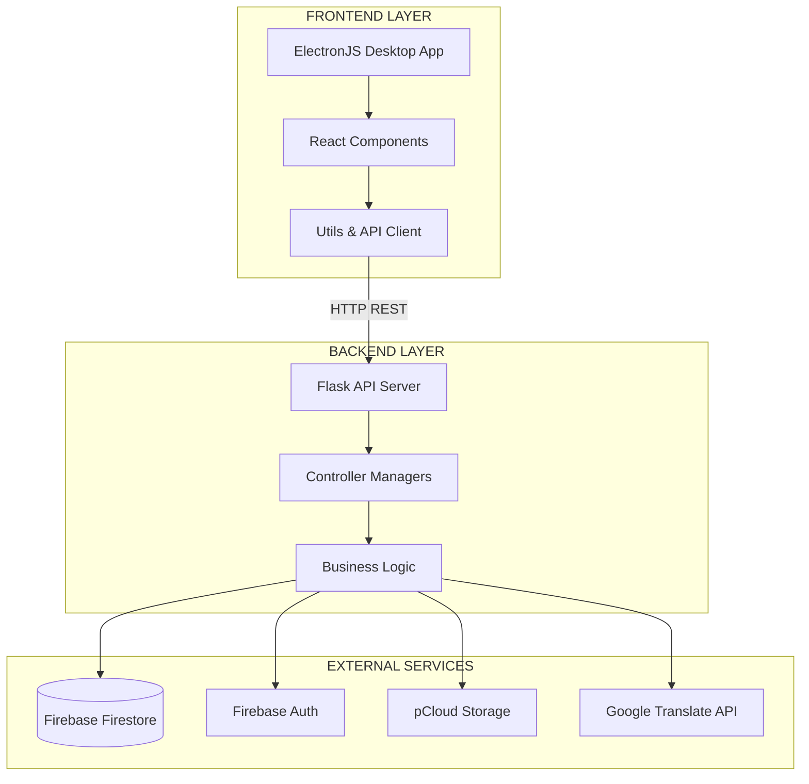
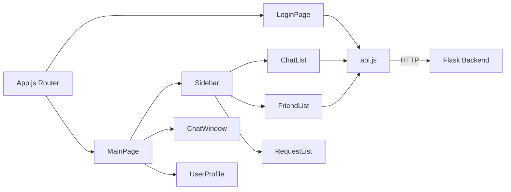
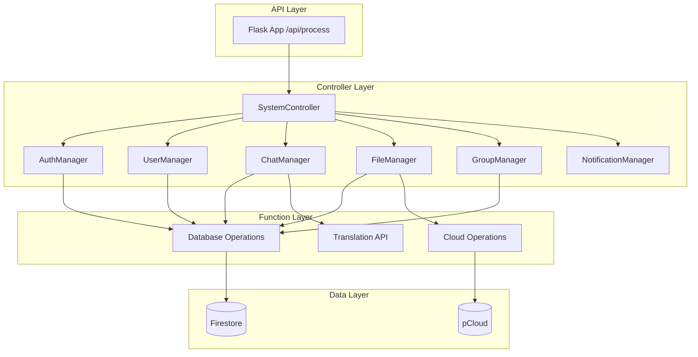
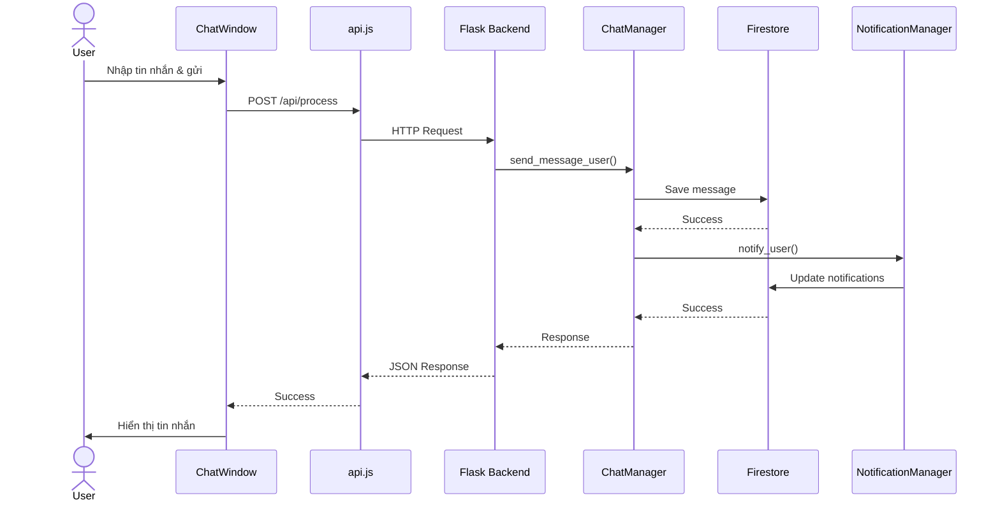
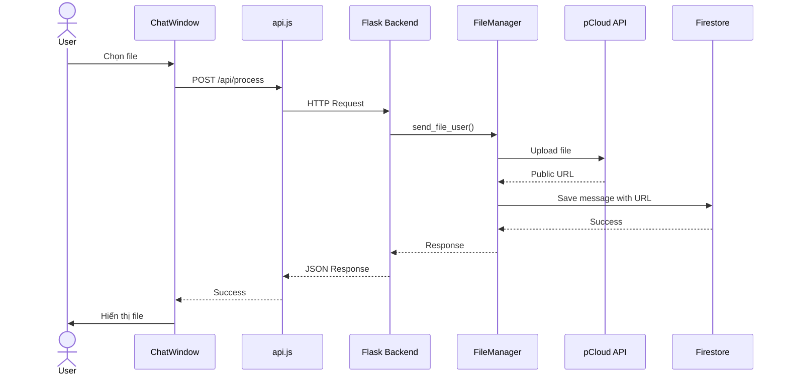
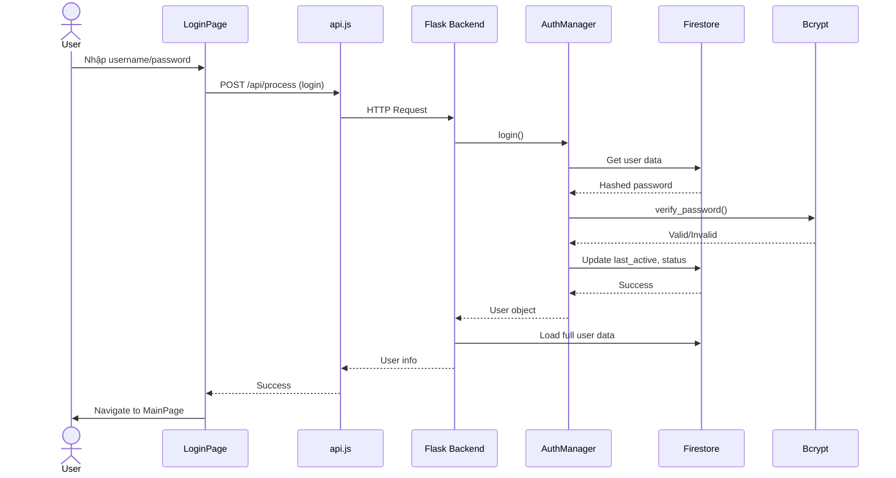
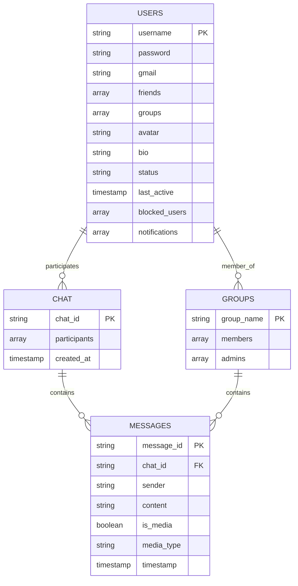
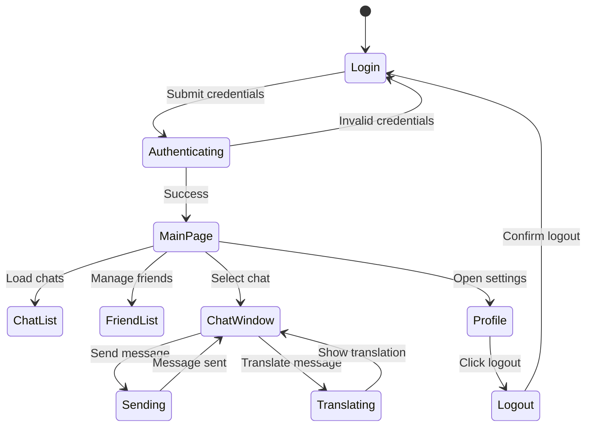
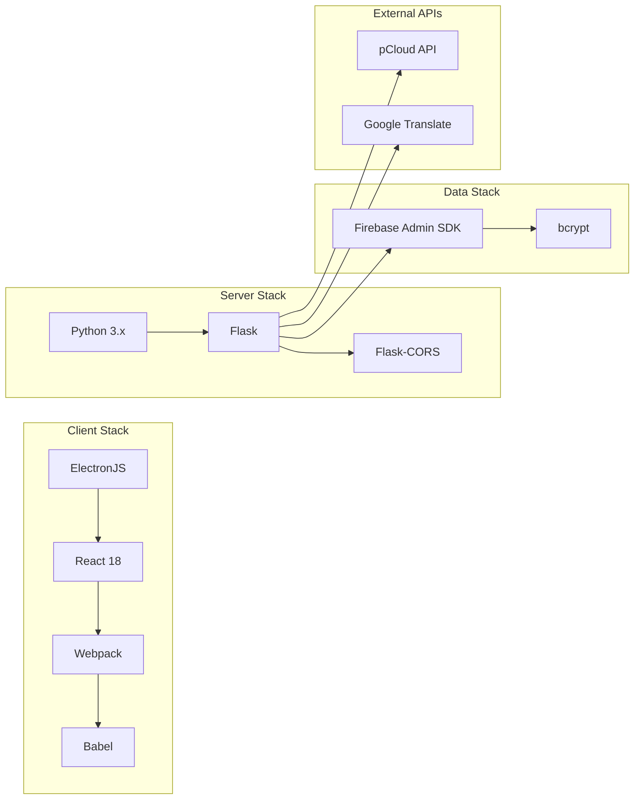
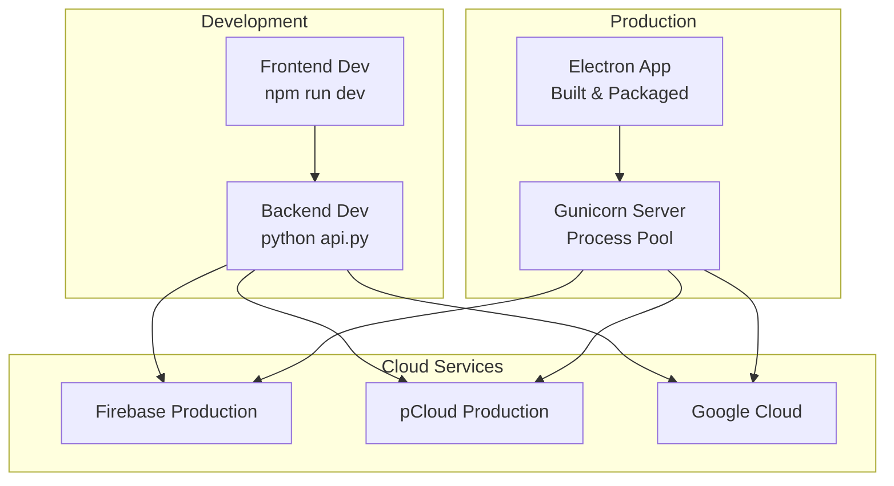

# Sơ Đồ Kiến Trúc Phần Mềm

## Tổng Quan Hệ Thống

## Cấu Trúc Frontend

## Backend Architecture

## Data Flow - Send Message

## Data Flow - Upload File

## Authentication Flow

## Database Schema

## Component Interaction

## Technology Stack

## Deployment Architecture

